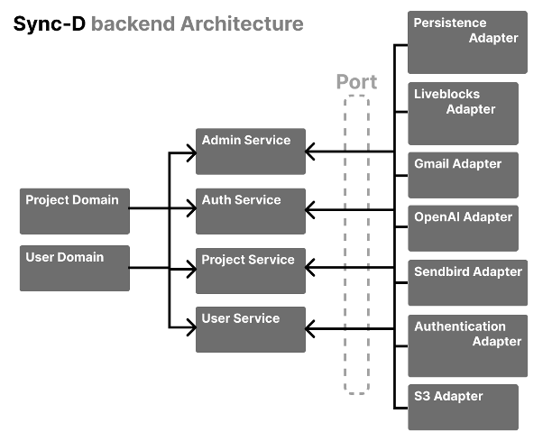
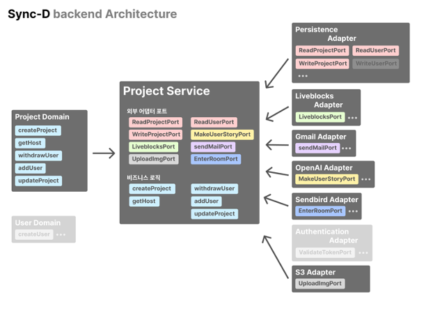
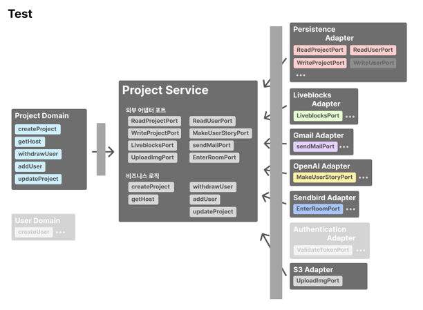

# sync-d-backend

## Architecture

## Directory
헥사고날 구현을 위한 파일 구조 (...은 같은 유형의 파일 or 디렉토리 반복을 의미합니다.)

 

## 소개

저희는 스프링 백엔드 프로젝트에 헥사고날 아키텍처(Ports and Adapters Architecture)를 진행했습니다. layer 구조는 layer 간의 의존성이 너무 얽혀있어 보기 아키텍처를 파악하기 어려워 hexagonal 구조를 채택하였습니다.

해당 아키텍처 패턴은 핵심 비즈니스 로직을 데이터베이스, UI 프레임워크, 서드 파티 서비스 등 외부 시스템과 분리하는 것을 강조합니다. 아래에서는 헥사고날 아키텍처를 선택한 이유와 경험을 기반으로한 장단점을 작성해보겠습니다.

 

## 헥사고날 아키텍처 도입 이유

SaaS 서비스인 Liveblock을 사용하려던 중, 해당 라이브러리가 Node.js에서만 제공된다는 사실을 알게 되었습니다.
이에 팀원들과 Node.js를 사용할지, Spring으로 라이브러리를 옮긴 후 백엔드 코드를 작성할지 고민했습니다.
**내부 회의를 통해 Spring으로 라이브러리를 옮기는 것이 도전이 될 수 있다고 판단했고,** 팀원들이 Spring을 선호하여 Spring으로 이전을 결정했습니다.

JS로 작성된 코드와 공식 문서를 참고하여 필요한 로직을 추출해 Spring 기반의 라이브러리로 마이그레이션에 성공했습니다.
**그러나 코드 내부적으로 캡슐화가 제대로 이루어지지 않아 서비스 로직의 코드가 난잡해지면서 의존성 관리가 어려워졌습니다.**
이대로 프로젝트를 진행하면 코드가 혼란스러워지고 협업 시 어려움이 많을 것으로 예상되었습니다.
이에 여러 백엔드 코드 구조를 살펴본 결과, 많은 기업들이 이런 문제를 DDD와 헥사고날 아키텍처를 통해 해결했다는 사실을 알게 되었습니다.
헥사고날 아키텍처의 주요 특징은 다음과 같습니다.

 

### **관심사의 분리**
헥사고날 아키텍처는 핵심 비즈니스 로직과 외부 요소들을 분리합니다. 이를 통해 외부 시스템의 변경이 핵심 비즈니스 로직에 직접적인 영향을 미치지 않도록 합니다.

### **테스트 용이성**
비즈니스 로직을 외부 종속성에서 분리함으로써, 외부 시스템을 모킹(mock)하거나 스터빙(stub)하지 않고도 핵심 로직에 대한 단위 테스트를 쉽게 작성할 수 있습니다.

### **유지보수성**
이 아키텍처는 코드 구조를 명확하게 하여 유지보수를 쉽게 합니다. 특정 기능이 변경되더라도 해당 기능에만 집중하여 수정할 수 있습니다.

### **확장성**
새로운 기능 추가나 변경 요구사항이 발생했을 때, 핵심 로직을 건드리지 않고도 외부 어댑터만 수정하거나 추가하여 쉽게 확장할 수 있습니다.

 
의존성 역전 원칙과 개방 폐쇄 원칙을 동시에 만족할 수 있어 상위 모듈이 하위 모듈에 의존하지 않았습니다.
이를 통해 위에서 발생했던 문제의 대부분을 해결할 수 있었습니다.
처음 프로젝트를 진행할 때, 단위 테스트를 적극적으로 작성하자는 팀 내 목표도 있었기 때문에, 헥사고날 아키텍처를 공부하며 적용하게 되었습니다.

## 구축

헥사고날을 사용해 도메인 계층에서 외부와 분리된 비즈니스 로직을 구현하였고 어댑터 계층에서 외부 의존성이 있는 기능들을 구현하였습니다. 그리고 서비스 게층에서 이러한 기능들을 조합하여 사용하여 확장에 용이하도록 하였습니다.

뿐만 아니라 의존성 역전 원칙을 엄수해 컴포넌트들간의 결합도를 줄이고 시스템의 확장성과 유연성을 높였습니다. 그리고 이를 통해 각 컴포너트들이 별도의 테스트가 가능하도록 만들었습니다.

적용 후 느낀 장단점은 다음과 같습니다.

처음 프로젝트를 진행할 때, 단위 테스트를 적극적으로 작성하자는 팀 내 목표가 있었기 때문에, 헥사고날 아키텍처를 공부하며 적용하게 되었습니다. 적용 후 느낀 장단점은 다음과 같습니다.

## 헥사고날 아키텍처의 장점
### **독립성**
비즈니스 로직이 외부 시스템에 의존하지 않기 때문에, 비즈니스 로직의 독립성을 유지할 수 있습니다.

### **유연성**
새로운 기술이나 외부 시스템을 도입할 때, 기존 비즈니스 로직을 변경하지 않고 어댑터만 추가하거나 교체할 수 있습니다.

### **높은 테스트 커버리지**
외부 시스템의 영향을 받지 않고 핵심 로직에 대한 테스트를 작성할 수 있어 높은 테스트 커버리지를 유지할 수 있습니다.

 

## 헥사고날 아키텍처의 단점

### **초기 복잡성**
초기에 구조를 설정하고 이해하는 데 시간이 걸렸습니다.
### **추가적인 추상화 레이어**
포트와 어댑터를 정의하고 구현해야 하므로 코드베이스가 복잡해졌습니다.
### **일관성 유지**
여러 어댑터와 포트를 관리하면서 일관성을 유지하는 것이 어려웠습니다. 특히, DTO, Mapper, 예외 처리 코드의 위치를 결정하는 데 많은 고민이 필요했습니다.

 

## 결론

처음 구축을 진행할 때에는 많은 어려움이 있었지만, 각 port와 adpator을 만들고 이를 service에서 조립하여 사용하니 의존성 관리가 편해졌습니다.
테스트 코드도 in, out에 대해서 있는 port를 기반으로 layer가 분리되므로, 각 부분들에 대해서 단위테스트를 진행하기 쉬워서 테스트 코드 작성에도 용이했습니다.
