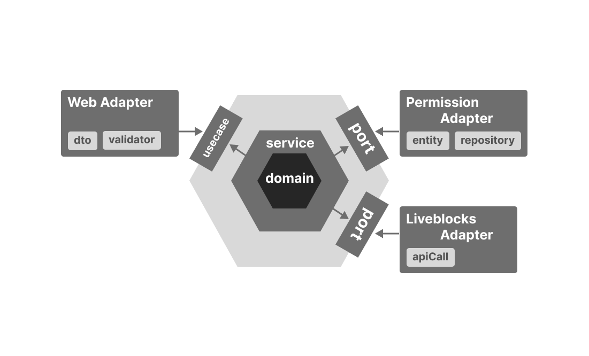

# sync-d-backend

## Architecture

layer 구조는 layer 간의 의존성이 너무 얽혀있어 보기 아키텍처를 파악하기 어려워 hexagonal 구조를 채택하였습니다.

## Directory
헥사고날 구현을 위한 파일 구조 (...은 같은 유형의 파일 or 디렉토리 반복을 의미합니다)
```
src
├─main
│ ├─java
│ │ └─com.syncd
│ │   ├─adapter
│ │   │ ├─in
│ │   │ │ ├─web
│ │   │ │ │ ├─exception
│ │   │ │ │ │ ├─exceptions
│ │   │ │ │ │ │ ├─Exception.java
│ │   │ │ │ │ │ └─ ...
│ │   │ │ │ │ ├─ExceptionHandler.java
│ │   │ │ │ │ └─ ...
│ │   │ │ │ ├─WebConfig.java
│ │   │ │ │ ├─Controller.java
│ │   │ │ │ └─ ...
│ │   │ └─out
│ │   │   ├─liveblock
│ │   │   │ └─LiveblockApiAdapter.java
│ │   │   └─persistence
│ │   │     ├─repository
│ │   │     │ ├─collection
│ │   │     │ │ ├─CollectionDao.java
│ │   │     │ │ └─CollectionEntity.java
│ │   │     │ └─ ...
│ │   │     ├─MongoConfig.java
│ │   │     ├─PersistenceAdapter.java
│ │   │     └─ ...
│ │   ├─applicaion
│ │   │ ├─domain
│ │   │ │ ├─domainName
│ │   │ │ │ ├─DomainName.java
│ │   │ │ │ └─DomainNameMapper.java
│ │   │ │ └─ ...
│ │   │ ├─port
│ │   │ │ ├─in
│ │   │ │ │ ├─Usecase.java
│ │   │ │ │ └─ ...
│ │   │ │ └─out
│ │   │ │   ├─portName
│ │   │ │     ├─dto
│ │   │ │     │ ├─Dto.java
│ │   │ │     │ └─ ...
│ │   │ │     ├─Port.java
│ │   │ │     └─ ...
│ │   │ └─service
│ │   ├─enums
│ │   │ ├─Enum.java
│ │   │ └─ ... 
│ │   └─SyncdApplication
│ └─resources
└─test
  └─(구현 중)
```
